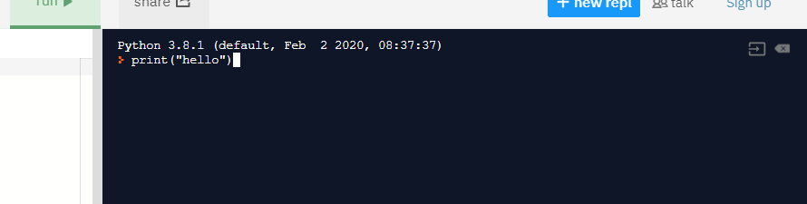
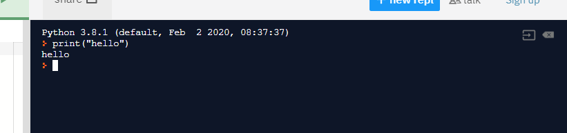

# Learn to Code
This e-book introduces the basics of programming a computer. It's a WIP...


## The basics

!> First off don't worry about some of the technical words used in this section. You don't have to remember them!

Computers deal 2 things: **data** and **instructions**.

**Data** is things that the computer knows or remembers. For example it might know the number of people in a city or remember a count of the number of times you tried to guess a number.

**Instructions** are things that tell the computer what to do. For example, display a message in the screen or add one to the number of guesses you have made.

Data and instructions go together to create a **computer program** which is what the computer runs or executes to do its job.

Your job as a computer programmer is to write computer programs for the computer to follow


## Trying it out

?> This book uses a programming language called **Python**. To keep things simple we are going to use web site to run Python in your web browser but you can install Python on most computers so it is a great programming language to learn with.

1. Open a new web browser window and browse to: https://repl.it/languages/python3

2. Click into the black area of the screen and type the following. **Make sure you type it exactly as you see below. Don't worry about the colors they are just there to make it easier to read.**

``` python
print("hello")
```

Your screen should look like this:



3. Now press the **Enter** key on your computer... you should now see something like this:



**Congratulations! you have just written your first computer program!**

?> Try make the computer say something else. Can you make it say your name ?


## Ignore all of this stuff below :)

``` python
print('enter your name')
name=input()
print('your name is   ' + name)
```

And here is some code

``` python
import random

number_to_guess = random.randint(1,10)
number_of_guesses = 0
guess = -1

print("I'm thinking of a number from 1 to 10. Try guess it... ")

while guess != number_to_guess:  
  guess = int(input ("What is your guess? "))
  number_of_guesses = number_of_guesses + 1
  if guess > number_to_guess:
    print("Too high!")
  if guess < number_to_guess:
    print("Too Low!")  

print("That's right! You got it in ", number_of_guesses, " guesses")
```